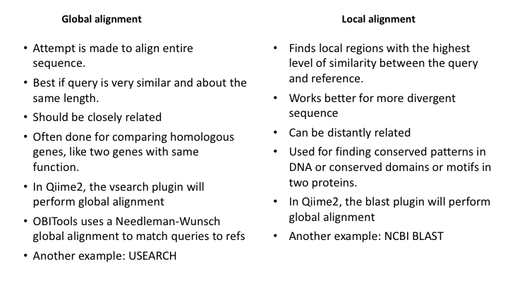

# Taxonomy assignment

Now that we have representative sequences from the denoising process (e.g. ZOTUs, ASVs, ESVs), we can assign taxonomy to them. There are several methods to do this. See the [**Qiime2 Overview**](https://docs.qiime2.org/2020.2/tutorials/overview/#taxonomy-classification-and-taxonomic-analyses) 

<br><br>

### Methods of Taxonomy classification

There are three basic approaches to taxonomy classification (and endless variations of each of these): Global alignment, local alignment, and Naive Bayes, or machine learning approaches in general. 


for a discussion of them see the [**paper**](https://microbiomejournal.biomedcentral.com/articles/10.1186/s40168-018-0470-z). 

We will start with the machine-learning based classification method, as that is generally favoured by the Qiime group (though 'best' is relative and will depend on many factors).

### Machine Learning


<br><br>


<br><br>

### Use Naive Bayes (machine learning) to classify in Qiime

In order to use the Naive Bayes (NB) method to assign taxonomy, it is necessary to train the sequence database first. Because this can take a great deal of time, a pre-trained classifier has been made available for you. The [Qiime2 Data Resources page](https://docs.qiime2.org/2020.2/data-resources/) provides some pre-trained classifiers for common primer combinations, as well as links to the Greengenes and Silva databases for 16S and 18S gene studies. For additional primer combinations, or other gene references, there is a [tutorial for training feature classifiers](https://docs.qiime2.org/2020.2/tutorials/feature-classifier/).

Use the command below, changing the name of the rep-seqs artifact that you have created:

```
qiime feature-classifier classify-sklearn \
  --i-classifier references/gg-13-8-99-515-806-nb-classifier.qza \
  --i-reads {REP-SEQS}.qza \
  --o-classification {TAXONOMY}.qza
```

You can then create a visualisation of the classification:

```
qiime metadata tabulate \
  --m-input-file {TAXONOMY}.qza \
  --o-visualization {TAXONOMY_VIZ}.qzv
```

To visualise the result:

```
qiime tools view {TAXONOMY_VIZ}.qzv
```

A barplot graph is a good way to compare the taxonomic profile among samples

```
qiime taxa barplot \
  --i-table {FREQ-TABLE}.qza \
  --i-taxonomy {TAXONOMY}.qza \
  --m-metadata-file sample_metadata.tsv \
  --o-visualization {TAXA-BAR-PLOTS_VIZ}.qzv
```

To view:

```
qiime tools view {TAXA-BAR-PLOTS_VIZ}.qzv
```

<br><br>

### Other methods to classify


<br>



<br><br>

### Use BLAST search to classify

Below is a command to use the BLAST classifier. With a virtual machine, this will likely use too much memory, so an output file for this is provided.

```
qiime feature-classifier classify-consensus-blast \
  --i-query {REP-SEQS}.qza \
  --i-reference-reads references/gg_99_reference_seqs.qza \
  --i-reference-taxonomy references/gg_99_reference_taxonomy.qza \
  --p-perc-identity 0.97 \
  --o-classification {REP-SEQS_BLAST_TAXONOMY}.qza \
  --verbose
```


Now generate the same visuals and compare the results from the two classification approaches

### Here are some example bar plots

[example bar plot](../example_viz/fish_swarmOTUs_300920_qiiExt1_NB_taxonomy_bar_plots.qzv)


